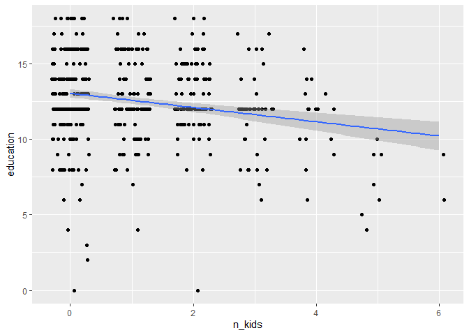
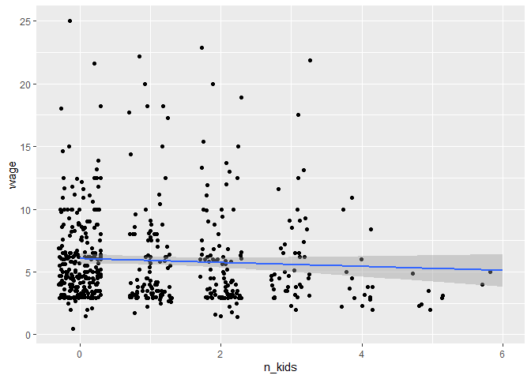
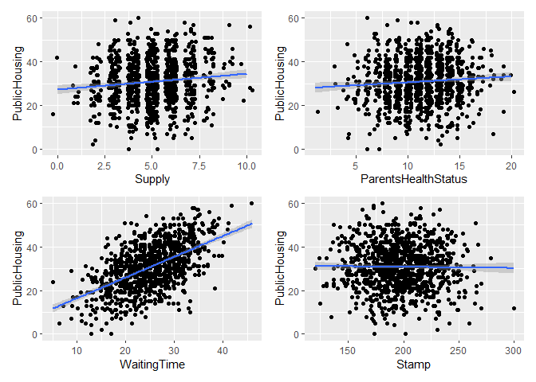
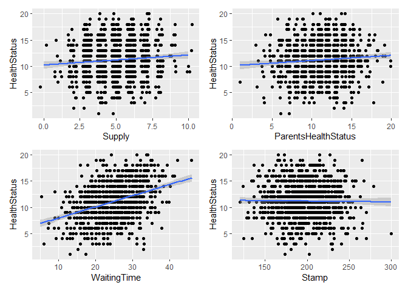

Instrumental Variable Approach
================
Lindsey Dorson

-   <a href="#task-1-education-wages-and-kids"
    id="toc-task-1-education-wages-and-kids">Task 1: Education, wages, and
    kids</a>
    -   <a href="#step-1" id="toc-step-1">Step 1</a>
    -   <a href="#step-2" id="toc-step-2">Step 2</a>
        -   <a href="#relevance" id="toc-relevance">Relevance</a>
        -   <a href="#exclusion" id="toc-exclusion">Exclusion</a>
        -   <a href="#exogeneity" id="toc-exogeneity">Exogeneity</a>
    -   <a href="#step-3" id="toc-step-3">Step 3</a>
        -   <a href="#first-stage" id="toc-first-stage">First Stage</a>
        -   <a href="#second-stage" id="toc-second-stage">Second Stage</a>
    -   <a href="#step-4" id="toc-step-4">Step 4</a>
    -   <a href="#step-5" id="toc-step-5">Step 5</a>
-   <a href="#task-2-public-housing-and-health"
    id="toc-task-2-public-housing-and-health">Task 2: Public housing and
    health</a>
    -   <a href="#step-1-1" id="toc-step-1-1">Step 1</a>
        -   <a href="#relevance-1" id="toc-relevance-1">Relevance</a>
        -   <a href="#exclusion-1" id="toc-exclusion-1">Exclusion</a>
        -   <a href="#exogeneity-1" id="toc-exogeneity-1">Exogeneity</a>
    -   <a href="#step-2-1" id="toc-step-2-1">Step 2</a>
    -   <a href="#step-3-1" id="toc-step-3-1">Step 3</a>

------------------------------------------------------------------------

``` r
library(tidyverse)     
library(broom)         
library(estimatr)      
library(modelsummary) 
library(ggplot2)
library(magrittr)
library(kableExtra)
library(patchwork)
```

# Task 1: Education, wages, and kids

Let’s look once again at the effect of education on earnings. You’ll use
data from the 1976 Current Population Survey run by the US Census. The
data is available as `wage` in the **wooldridge** R package—here I’ve
just taken a subset of variables and renamed them. There are three
columns:

| Variable name | Description                               |
|---------------|-------------------------------------------|
| `wage`        | Average hourly earnings (in 1976 dollars) |
| `education`   | Years of education                        |
| `n_kids`      | Number of dependents living at home       |

You’re interested in estimating $\beta_1$ in:

$$
\text{Wage}_i = \beta_0 + \beta_1 \text{Education}_i + \epsilon_i
$$

However, there is an issue with omitted variable bias and endogeneity.
Instrumental variables can potentially help address the endogeneity.

## Step 1

Load and look at the dataset

``` r
wages <- read_csv("data/wages.csv")
```

## Step 2

We need an instrument for education, since part of it is endogenous. Do
you think the variable `n_kids` (the number of children) would be a
valid instrument? Does it meet the three requirements of a valid
instrument?

I think there could be some relationship between number of kids and
education but I doubt it would be strong enough. Also, I am not sure if
it would pass the exclusionary and exogeneity principle. For example,
number of kids could affect amount of work hours or type of work someone
has (travel requirements). Both of these factors affect wages.
Therefore, I do not think it would be a strong instrument.

Explain why it passes or fails each of the three requirements for a
valid instrument. Test the requirements where possible using
scatterplots and regression.

### Relevance

``` r
cor(wages$education,wages$n_kids)
```

    ## [1] -0.2152914

``` r
ggplot(wages, aes(x= n_kids, y = education)) +
  geom_point(position =position_jitter(width = 0.3, height = 0)) +
  geom_smooth(method = "lm")
```

    ## `geom_smooth()` using formula 'y ~ x'

<!-- -->

Visually there appears to be a slight relationship between the
variables.

``` r
check_relevance <- lm(education ~ n_kids, data = wages)
tidy(check_relevance)
```

    ## # A tibble: 2 × 5
    ##   term        estimate std.error statistic   p.value
    ##   <chr>          <dbl>     <dbl>     <dbl>     <dbl>
    ## 1 (Intercept)   13.1      0.153      85.2  3.22e-309
    ## 2 n_kids        -0.472    0.0936     -5.05 6.21e-  7

``` r
glance(check_relevance)
```

    ## # A tibble: 1 × 12
    ##   r.squ…¹ adj.r…² sigma stati…³ p.value    df logLik   AIC   BIC devia…⁴ df.re…⁵
    ##     <dbl>   <dbl> <dbl>   <dbl>   <dbl> <dbl>  <dbl> <dbl> <dbl>   <dbl>   <int>
    ## 1  0.0464  0.0445  2.71    25.5 6.21e-7     1 -1269. 2544. 2557.   3839.     524
    ## # … with 1 more variable: nobs <int>, and abbreviated variable names
    ## #   ¹​r.squared, ²​adj.r.squared, ³​statistic, ⁴​deviance, ⁵​df.residual

Also,the F-stat is above 10 and there is a significant relationship
between the instrument (n_kids) and education. Therefore, it passes
relevance.

### Exclusion

``` r
ggplot(wages, aes(x = n_kids, y = wage)) +
  geom_point(position =position_jitter(width = 0.3, height = 0)) +
  geom_smooth(method = "lm")
```

    ## `geom_smooth()` using formula 'y ~ x'

<!-- -->

There appears to be a slight negative relationship between the potential
instrument and wages. Potentially an increase in the number of kids
decreases the average hourly earnings only because it decreases one’s
education. However, this does seem hard to argue.

### Exogeneity

I could see number of kids being related to many possible omitted
variables like spousal support, adult family members, and age of the
worker. Therefore, I don’t think it passes the exogeneity principle.

## Step 3

Assume that the number of children is a valid instrument (regardless of
whatever you concluded earlier). Using the number of children (`n_kids`)
as an instrument for education (`education`), estimate the effect of
education on wages via two-stage least squares (2SLS) instrumental
variables (IV).

Do this by hand: create a first stage model, extract the predicted
education, and use predicted education in the second stage.

Interpret the coefficient that gives the effect of education on wages
($\beta_1$) and its significance.

### First Stage

``` r
first_stage <- lm(education ~ n_kids, data = wages)
wages_with_prediction <- augment_columns(first_stage, wages)%>%
  rename(educ_hat = .fitted)
head(wages_with_prediction)
```

    ## # A tibble: 6 × 10
    ##    wage education n_kids educ_hat .se.fit .resid    .hat .sigma  .cooksd .std.…¹
    ##   <dbl>     <dbl>  <dbl>    <dbl>   <dbl>  <dbl>   <dbl>  <dbl>    <dbl>   <dbl>
    ## 1   3.1        11      2     12.1   0.148 -1.11  0.00299   2.71  2.54e-4  -0.411
    ## 2   3.2        12      3     11.6   0.218  0.361 0.00648   2.71  5.85e-5   0.134
    ## 3   3          11      2     12.1   0.148 -1.11  0.00299   2.71  2.54e-4  -0.411
    ## 4   6           8      0     13.1   0.153 -5.06  0.00320   2.70  5.63e-3  -1.87 
    ## 5   5.3        12      1     12.6   0.118 -0.583 0.00190   2.71  4.44e-5  -0.216
    ## 6   8.8        16      0     13.1   0.153  2.94  0.00320   2.71  1.91e-3   1.09 
    ## # … with abbreviated variable name ¹​.std.resid

### Second Stage

``` r
second_stage <- lm(wage ~ educ_hat, data = wages_with_prediction)
tidy(second_stage)
```

    ## # A tibble: 2 × 5
    ##   term        estimate std.error statistic p.value
    ##   <chr>          <dbl>     <dbl>     <dbl>   <dbl>
    ## 1 (Intercept)    1.71      3.40      0.503   0.615
    ## 2 educ_hat       0.333     0.270     1.23    0.218

An additional year of education, increases average hourly wage by 33.3%
. However, the result is not significant.

(Remember that you can also use the `iv_robust()` function from the
**estimatr** package to run IV/2SLS models in one step with:
`iv_robust(y ~ x | z, data = data)`, where `y` is the outcome, `x` is
the policy/program, and `z` is the instrument. Try doing this to check
your manual two-stage model.)

``` r
model_2sls <- iv_robust(wage ~ education | n_kids,
                        data = wages)
tidy(model_2sls)
```

    ##          term  estimate std.error statistic   p.value   conf.low conf.high  df
    ## 1 (Intercept) 1.7093781 2.8030095 0.6098367 0.5422343 -3.7971383 7.2158945 524
    ## 2   education 0.3331669 0.2221214 1.4999318 0.1342343 -0.1031909 0.7695247 524
    ##   outcome
    ## 1    wage
    ## 2    wage

The one step instrumental variable model gives the same coefficient but
with a more accurate standard error,test statistic,and p value estimate.
The result still maintains its insignificance.

## Step 4

Run a naive model predicting the effect of education on wages
(i.e. without any instruments). How does this naive model compare with
the IV model?

``` r
model_naive<- lm(wage ~ education, data = wages)
tidy(model_naive)
```

    ## # A tibble: 2 × 5
    ##   term        estimate std.error statistic  p.value
    ##   <chr>          <dbl>     <dbl>     <dbl>    <dbl>
    ## 1 (Intercept)   -0.902    0.685      -1.32 1.89e- 1
    ## 2 education      0.541    0.0533     10.2  3.09e-22

Show the results side-by-side here:

``` r
modelsummary(list("OLS" = model_naive,
                  "2SLS (by hand)" = second_stage, "2SLS (automatic)" = model_2sls),
             gof_omit = "IC|Log|Adj|p\\.value|statistic|se_type",
             stars = TRUE) %>%
  row_spec(c(3, 5), background ="orange")
```

    ## Warning in row_spec(., c(3, 5), background = "orange"): Please specify format
    ## in kable. kableExtra can customize either HTML or LaTeX outputs. See https://
    ## haozhu233.github.io/kableExtra/ for details.

|             |     OLS     | 2SLS (by hand) | 2SLS (automatic) |
|:------------|:-----------:|:--------------:|:----------------:|
| (Intercept) |   -0.902    |     1.709      |      1.709       |
|             |   (0.685)   |    (3.400)     |     (2.803)      |
| education   | 0.541\*\*\* |                |      0.333       |
|             |   (0.053)   |                |     (0.222)      |
| educ_hat    |             |     0.333      |                  |
|             |             |    (0.270)     |                  |
| Num.Obs.    |     526     |      526       |       526        |
| R2          |    0.164    |     0.003      |      0.140       |
| F           |   103.118   |     1.519      |                  |
| RMSE        |    3.37     |      3.69      |       3.42       |

**Note:** ^^ + p \< 0.1, \* p \< 0.05, \*\* p \< 0.01, \*\*\* p \< 0.001

The naive model has a larger education coefficient and the result is
significant unlike the 2SLS model.

## Step 5

Explain which estimates (OLS vs. IV/2SLS) you would trust more.

I would distrust both models since the OLS model suffers from omitted
variable bias that could skew the true effect of education on wages and
the Instrumental model utilizes an invalid instrument.

------------------------------------------------------------------------

# Task 2: Public housing and health

[Economic research shows](https://dx.doi.org/10.1002/pam.20288) that
there is a potential (albeit weak) connection between health outcomes
and residency in public housing. You are interested in finding the
effect of public housing assistance on health outcomes. In the absence
of experimental data, you must use observational data collected by the
Georgia Department of Public Health. You have access to a dataset of
1,000 rows with the following columns:

| Variable name         | Description                                                                      |
|-----------------------|----------------------------------------------------------------------------------|
| `HealthStatus`        | Health status on a scale from 1 = poor to 20 = excellent                         |
| `HealthBehavior`      | Omitted variable (you can’t actually measure this!)                              |
| `PublicHousing`       | Number of years spent in public housing                                          |
| `Supply`              | Number of available public housing units in the city per 100 eligible households |
| `ParentsHealthStatus` | Health status of parents on a scale from 1 = poor to 20 = excellent              |
| `WaitingTime`         | Average waiting time before obtaining public housing in the city (in months)     |
| `Stamp`               | Dollar amount of food stamps (SNAP) spent each month                             |
| `Age`                 | Age                                                                              |
| `Race`                | Race; 1 = White, 2 = Black, 3 = Hispanic, 4 = Other                              |
| `Education`           | Education; 1 = Some high school, 2 = High school, 3 = Bachelor’s, 4 = Master’s   |
| `MaritalStatus`       | Marital status; 1 = Single, 2 = Married, 3 = Widow, 4 = Divorced                 |

(This is simulated data, but it’s based on analysis by [Angela R. Fertig
and David A. Reingold](https://dx.doi.org/10.1002/pam.20288))

Your goal is to measure the effect of living in public housing
(`PublicHousing`) on health (`HealthStatus`). There is omitted variable
bias, though, since people who care more about their health might be
more likely to self-select into public housing and report a better
health status score. The magic variable `HealthBehavior` measures this
omitted variable, and you can use it as reference to make sure you get
the models right (this is the same as “ability” in the examples in
class), but don’t include it in any of your actual models, since it’s
not real.

This data includes four potential instruments:

-   `Supply`: Number of available public housing units in the city per
    100 eligible households
-   `ParentsHealthStatus`: Health status of parents on a scale from 1 =
    poor to 5 = excellent
-   `WaitingTime`: Average waiting time before obtaining public housing
    in the city (in months)
-   `Stamp`: Dollar amount of food stamps (SNAP) spent each month

You have three tasks:

1.  Evaluate the suitability of each of the four potential instruments.
    Check if they (1) have *relevance* with a scatterplot and model and
    F-test, (2) meet the *excludability* assumption, and (3) meet the
    *exogeneity* assumption. Choose one of these as your main instrument
    and justify why it’s the best. Explain why the other three are not.

2.  Estimate a naive model of the effect of public housing on health
    status (i.e. without any instruments). You can include any control
    variables you feel appropriate (i.e. that fit in your causal model).
    If you use variables that are categorical like race, education, or
    marital status, make sure you wrap them with `as.factor()` to treat
    them as categories instead of numbers (e.g. `as.factor(education)`).

Estimate the effect of public housing on health status using 2SLS IV.
You can use `iv_robust()` to do it all in one step if you want (but
you’ll still need to run a first-stage model to find the F statistic).
Compare the results with the naive model. Which model do you trust (if
any), and why?

``` r
housing <- read_csv("data/public_housing.csv")
```

## Step 1

### Relevance

``` r
supply_plot<-ggplot(housing, aes(x = Supply, y = PublicHousing)) +
  geom_point(position =position_jitter(width = 0.3, height = 0)) +
  geom_smooth(method = "lm")
parent_plot<-ggplot(housing, aes(x = ParentsHealthStatus, y = PublicHousing)) +
  geom_point(position =position_jitter(width = 0.3, height = 0)) +
  geom_smooth(method = "lm")
waiting_plot<-ggplot(housing, aes(x = WaitingTime, y = PublicHousing)) +
  geom_point(position =position_jitter(width = 0.3, height = 0)) +
  geom_smooth(method = "lm")
stamp_plot<-ggplot(housing, aes(x = Stamp, y = PublicHousing)) +
  geom_point(position =position_jitter(width = 0.3, height = 0)) +
  geom_smooth(method = "lm")

supply_plot + parent_plot + waiting_plot + stamp_plot
```

    ## `geom_smooth()` using formula 'y ~ x'
    ## `geom_smooth()` using formula 'y ~ x'
    ## `geom_smooth()` using formula 'y ~ x'
    ## `geom_smooth()` using formula 'y ~ x'

<!-- -->

``` r
supply_model <- lm(PublicHousing ~ Supply, data = housing)
parent_model <- lm(PublicHousing ~ ParentsHealthStatus, data = housing)
waiting_model <- lm(PublicHousing ~ WaitingTime, data = housing)
stamp_model <- lm(PublicHousing ~ Stamp, data = housing)

modelsummary(list("Supply" = supply_model,
                  "Parent" = parent_model, "Waiting" = waiting_model,
                  "Stamp" = stamp_model),
             gof_omit = "IC|Log|Adj|p\\.value|statistic|se_type",
             stars = TRUE) %>%
  row_spec(c(3, 5,7 ,9,13), background ="orange")
```

    ## Warning in row_spec(., c(3, 5, 7, 9, 13), background = "orange"): Please specify
    ## format in kable. kableExtra can customize either HTML or LaTeX outputs. See
    ## https://haozhu233.github.io/kableExtra/ for details.

|                     |    Supply    |    Parent    |   Waiting   |    Stamp     |
|:--------------------|:------------:|:------------:|:-----------:|:------------:|
| (Intercept)         | 27.107\*\*\* | 27.772\*\*\* | 6.991\*\*\* | 31.805\*\*\* |
|                     |   (1.067)    |   (1.288)    |   (1.141)   |   (2.384)    |
| Supply              | 0.729\*\*\*  |              |             |              |
|                     |   (0.202)    |              |             |              |
| ParentsHealthStatus |              |   0.270\*    |             |              |
|                     |              |   (0.112)    |             |              |
| WaitingTime         |              |              | 0.951\*\*\* |              |
|                     |              |              |   (0.044)   |              |
| Stamp               |              |              |             |    -0.005    |
|                     |              |              |             |   (0.012)    |
| Num.Obs.            |     1000     |     1000     |    1000     |     1000     |
| R2                  |    0.013     |    0.006     |    0.316    |    0.0002    |
| F                   |    13.024    |    5.807     |   460.710   |    0.190     |
| RMSE                |    10.32     |    10.36     |    8.59     |    10.39     |

**Note:** ^^ + p \< 0.1, \* p \< 0.05, \*\* p \< 0.01, \*\*\* p \< 0.001

The supply and waiting time variables are the only ones with an F stat
that is sufficient (\>10). Waiting time is noticably the largest at over
460.

### Exclusion

``` r
supply_plot2<-ggplot(housing, aes(x = Supply, y = HealthStatus)) +
  geom_point(position =position_jitter(width = 0.3, height = 0)) +
  geom_smooth(method = "lm")
parent_plot2<-ggplot(housing, aes(x = ParentsHealthStatus, y = HealthStatus)) +
  geom_point(position =position_jitter(width = 0.3, height = 0)) +
  geom_smooth(method = "lm")
waiting_plot2<-ggplot(housing, aes(x = WaitingTime, y = HealthStatus)) +
  geom_point(position =position_jitter(width = 0.3, height = 0)) +
  geom_smooth(method = "lm")
stamp_plot2<-ggplot(housing, aes(x = Stamp, y = HealthStatus)) +
  geom_point(position =position_jitter(width = 0.3, height = 0)) +
  geom_smooth(method = "lm")

supply_plot2 + parent_plot2 + waiting_plot2 + stamp_plot2
```

    ## `geom_smooth()` using formula 'y ~ x'
    ## `geom_smooth()` using formula 'y ~ x'
    ## `geom_smooth()` using formula 'y ~ x'
    ## `geom_smooth()` using formula 'y ~ x'

<!-- -->

Waiting time for public housing is the only one that shows a noticeable
relationship with the outcome(which is necessary). Also, proving that
waiting time has a causal effect on health status only through public
housing makes sense. Since, the longer you wait for public housing the
higher length you would utilize it (years).

### Exogeneity

Waiting time proves it could work as an instrument again because it
isn’t directly related to potential health behavior manipulation.
Parents health status and SNAP dollars have a noticeable relationship
with health behavior. For example, if a parents health is bad their
offspring are far more likely inclined to take better care of themself.

<u>Overall, waiting time for public housing seems like the stronger
instrument of choice due to the reasonings above.</u>

## Step 2

``` r
model_naive2<-lm(HealthStatus ~ PublicHousing + Age + as.factor(Race) + as.factor(Education), data = housing)
tidy(model_naive2)
```

    ## # A tibble: 9 × 5
    ##   term                  estimate std.error statistic  p.value
    ##   <chr>                    <dbl>     <dbl>     <dbl>    <dbl>
    ## 1 (Intercept)            -1.21     0.218      -5.56  3.48e- 8
    ## 2 PublicHousing           0.321    0.00254   126.    0       
    ## 3 Age                     0.0566   0.00437    12.9   1.77e-35
    ## 4 as.factor(Race)2       -0.0145   0.0742     -0.196 8.45e- 1
    ## 5 as.factor(Race)3        0.0532   0.0746      0.713 4.76e- 1
    ## 6 as.factor(Race)4       -0.0143   0.0743     -0.192 8.47e- 1
    ## 7 as.factor(Education)2   0.0221   0.0742      0.297 7.66e- 1
    ## 8 as.factor(Education)3  -0.0109   0.0744     -0.146 8.84e- 1
    ## 9 as.factor(Education)4  -0.0716   0.0742     -0.964 3.35e- 1

## Step 3

``` r
first_stage2<- lm(PublicHousing ~ WaitingTime + Age + as.factor(Race) + as.factor(Education), data = housing)
model_2sls2<-iv_robust(HealthStatus ~ PublicHousing | WaitingTime + Age + as.factor(Race) + as.factor(Education), data = housing, diagnostics =TRUE)


modelsummary(list("2SLS" = model_2sls2,
                  "First_Stage" = first_stage2,
                 "OLS" = model_naive2),
             gof_omit = "IC|Log|Adj|p\\.value|statistic|se_type",
             stars = TRUE) %>%
  row_spec(c(3, 5), background ="orange")
```

    ## Warning in row_spec(., c(3, 5), background = "orange"): Please specify format
    ## in kable. kableExtra can customize either HTML or LaTeX outputs. See https://
    ## haozhu233.github.io/kableExtra/ for details.

|                       |    2SLS     | First_Stage |     OLS      |
|:----------------------|:-----------:|:-----------:|:------------:|
| (Intercept)           | 4.013\*\*\* |    3.265    | -1.213\*\*\* |
|                       |   (0.216)   |   (2.426)   |   (0.218)    |
| PublicHousing         | 0.233\*\*\* |             | 0.321\*\*\*  |
|                       |   (0.007)   |             |   (0.003)    |
| WaitingTime           |             | 0.946\*\*\* |              |
|                       |             |   (0.044)   |              |
| Age                   |             |   0.077+    | 0.057\*\*\*  |
|                       |             |   (0.045)   |   (0.004)    |
| as.factor(Race)2      |             |    0.196    |    -0.015    |
|                       |             |   (0.768)   |   (0.074)    |
| as.factor(Race)3      |             |  2.021\*\*  |    0.053     |
|                       |             |   (0.769)   |   (0.075)    |
| as.factor(Race)4      |             |    0.482    |    -0.014    |
|                       |             |   (0.769)   |   (0.074)    |
| as.factor(Education)2 |             |   -0.294    |    0.022     |
|                       |             |   (0.767)   |   (0.074)    |
| as.factor(Education)3 |             |   -0.679    |    -0.011    |
|                       |             |   (0.770)   |   (0.074)    |
| as.factor(Education)4 |             |   -0.073    |    -0.072    |
|                       |             |   (0.768)   |   (0.074)    |
| Num.Obs.              |    1000     |    1000     |     1000     |
| R2                    |    0.861    |    0.325    |    0.943     |
| F                     |             |   59.624    |   2060.387   |
| RMSE                  |             |    8.54     |     0.83     |

**Note:** ^^ + p \< 0.1, \* p \< 0.05, \*\* p \< 0.01, \*\*\* p \< 0.001

``` r
summary(model_2sls2)
```

    ## 
    ## Call:
    ## iv_robust(formula = HealthStatus ~ PublicHousing | WaitingTime + 
    ##     Age + as.factor(Race) + as.factor(Education), data = housing, 
    ##     diagnostics = TRUE)
    ## 
    ## Standard error type:  HC2 
    ## 
    ## Coefficients:
    ##               Estimate Std. Error t value   Pr(>|t|) CI Lower CI Upper  DF
    ## (Intercept)     4.0129   0.216121   18.57  2.456e-66    3.589   4.4370 998
    ## PublicHousing   0.2326   0.006929   33.57 5.954e-166    0.219   0.2462 998
    ## 
    ## Multiple R-squared:  0.8612 ,    Adjusted R-squared:  0.8611 
    ## F-statistic:  1127 on 1 and 998 DF,  p-value: < 2.2e-16
    ## 
    ## Diagnostics:
    ##                  numdf dendf   value  p.value    
    ## Weak instruments     8   991   63.43  < 2e-16 ***
    ## Wu-Hausman           1   997 1024.64  < 2e-16 ***
    ## Overidentifying      7    NA   81.55 6.65e-15 ***
    ## ---
    ## Signif. codes:  0 '***' 0.001 '**' 0.01 '*' 0.05 '.' 0.1 ' ' 1

Based on the OLS model, an additional year in public housing causes a
32.1% increase in health, on average. Based on the 2SLS model, an
additional year in public housing causes a 23.3% increase in health, on
average. I would trust the 2SLS model since it controls for confounding
variables and utilizes a valid instrument (Weak instrument test).
